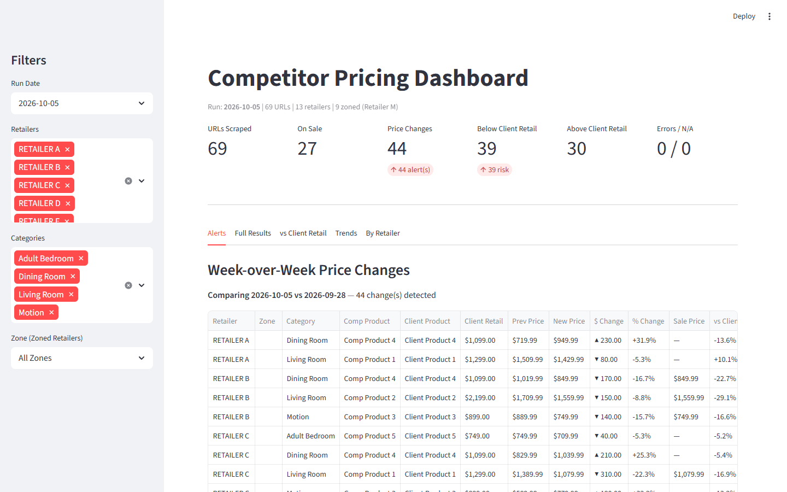
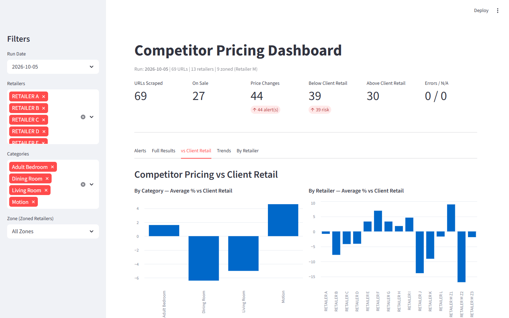
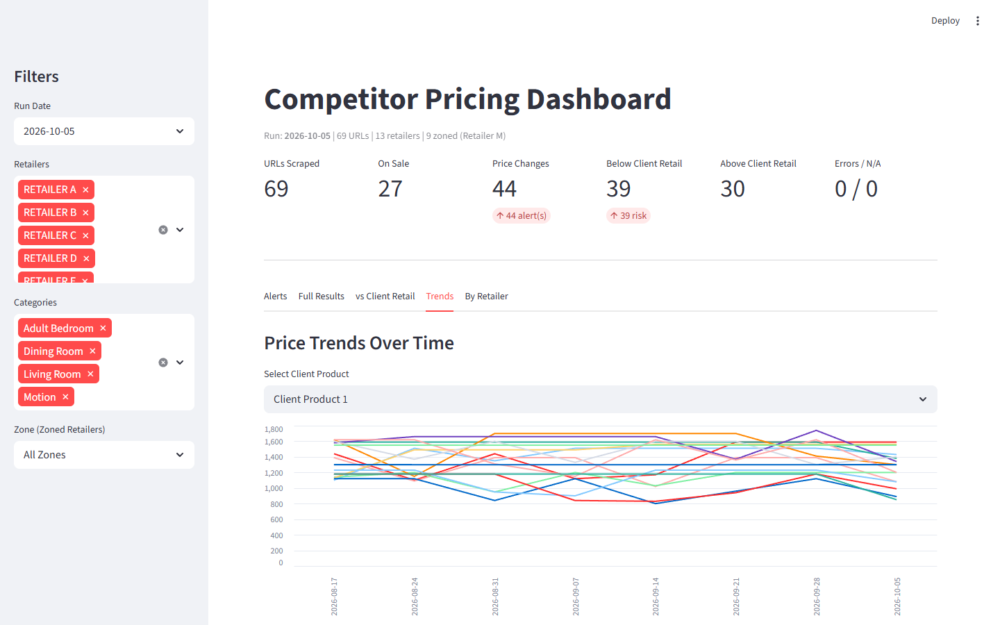

# Competitor Price Tracker

Automated weekly price intelligence built for a furniture retail client. Scrapes product pages across 13 competitor sites, stores a timestamped price history in SQLite, flags week-over-week changes, and benchmarks every competitor price against the client's own retail, delivered as a formatted Excel report and an interactive Streamlit dashboard.

**The problem:** the client's pricing team tracked competitors by hand: opening 100+ product pages every week, copying prices into a spreadsheet, and eyeballing what changed. Slow, error-prone, and blind to short-lived promotions.

**The result:** a one-command weekly run that collects every price, flags every change, and surfaces where competitors are undercutting the client, by product, category, retailer, and region.



> Client, retailer, and product names are anonymized (Retailer A–N, Client Product 1–5) and all screenshots use synthetic demo data. No real pricing data is included in this repository.

---

## What it does

- **Scrapes 13 retailers** with a dedicated extractor per site (list price, sale price, effective price)
- **Handles regional (zoned) pricing**: sets a ZIP code per browser session so prices reflect each market
- **Detects changes** week over week and calculates the dollar and percent delta
- **Benchmarks against client retail**: % above/below, markdown depth, on-sale status
- **Outputs** a color-coded Excel workbook (one sheet per retailer) and a dashboard with alerts, trends, and plain-English insights ("Promotional price dropped further — increased competitive pressure")

## Architecture

```
Excel input (product URLs + client retail)
            │
            ▼
   run_scraper.py ── routes each URL to the right engine
   ┌───────────────┬─────────────────┬────────────────┐
   │ HTTP batch    │ Chromium batch  │ Firefox batch  │   ← per-retailer choice
   └───────┬───────┴────────┬────────┴───────┬────────┘
           └──── scrapers/<retailer>.py extract() ────┘
                            │
                            ▼
                 SQLite price history (data/prices.db)
                     │                     │
                     ▼                     ▼
          excel_export.py          dashboard.py (Streamlit)
          weekly .xlsx report      alerts · vs retail · trends
```

## Engineering highlights

| Problem | Solution |
|---|---|
| Every retailer marks up prices differently | `BaseScraper` abstract class; each site implements `extract()`. Adding a retailer is one file. |
| Prices split across tags (`<sup>$</sup>899<sup>99</sup>`) read as `$89999` | Site-specific parsers that walk the DOM to separate dollars from cents ([retailer_e.py](scrapers/retailer_e.py), [retailer_m.py](scrapers/retailer_m.py)) |
| Some sites show "You save $X" but no original price | Reconstruct list price as `active + savings` ([retailer_m.py](scrapers/retailer_m.py)) |
| Structured data is more stable than CSS classes | Prefer JSON-LD `Product` offers and `itemprop` microdata, fall back to selectors |
| Regional pricing varies by ZIP | One browser context per zone; ZIP is set once, then all pages in that context inherit it |
| Sites that reject headless browsers | Per-retailer engine choice: plain HTTP with browser TLS fingerprinting via `curl_cffi`, Chromium, or Firefox. Blocked pages are detected and reported separately from errors. One site's enterprise bot protection is documented with options rather than forced ([retailer_n.py](scrapers/retailer_n.py)) |
| Slow-rendering price widgets cause false "no price" results | Automatic single retry before recording a failure |
| Rate limiting (HTTP 429) | Exponential backoff retries ([retailer_h.py](scrapers/retailer_h.py)) |
| Partial re-runs need to merge with the main run | `INSERT OR REPLACE` keyed on date + URL (+ zone), plus [reexport.py](reexport.py) to rebuild the report from the DB |

## Screenshots

| Competitor pricing vs client retail | Price trends over time |
|---|---|
|  |  |

## Quick start

```bash
pip install -r requirements.txt
playwright install chromium firefox

# Explore the dashboard with synthetic data (no scraping)
python demo/seed_demo_data.py
streamlit run dashboard.py
```

### Running a real scrape

1. Put your link files in `RESOURCES/` using the same columns as the samples in [sample_data/](sample_data/) (the sample URLs are placeholders)
2. Run:

```bash
python run_scraper.py                                        # all retailers
python run_scraper.py --test                                 # 2 URLs per retailer, quick smoke test
python run_scraper.py --retailer "Retailer E" "Retailer I"   # specific retailers
python run_scraper.py --retailer "Retailer M" --zone 1       # one zone of a zoned retailer
```

Results land in `OUTPUT/comp_scrape_YYYY-MM-DD.xlsx` and `data/prices.db`.

## Tech stack

Python · Playwright · curl_cffi · BeautifulSoup · pandas · SQLite · openpyxl · Streamlit

## Project structure

```
├── run_scraper.py        # entry point: load inputs, route, scrape, save, summarize
├── scrapers/             # one module per retailer, all subclass BaseScraper
├── db.py                 # SQLite schema + history queries
├── excel_export.py       # formatted, color-coded weekly workbook
├── dashboard.py          # Streamlit dashboard
├── reexport.py           # rebuild a day's report from the DB
├── demo/                 # synthetic data generators for the demo
└── sample_data/          # fictional input files showing the expected format
```

## Responsible use

This tool reads publicly listed prices at low volume: each tracked product page is requested once per weekly run, sequentially, with no parallel fan-out. Check each site's terms of service before running it, and keep request rates modest.

## License

MIT
